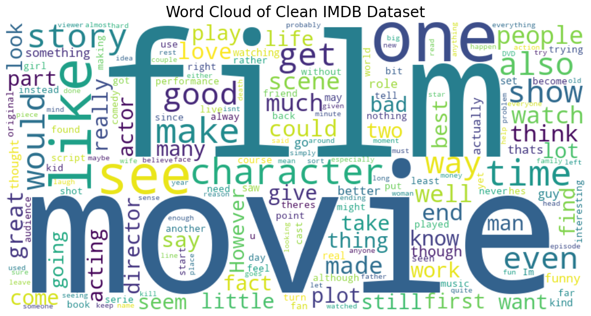

# 🎬 IMDb Sentiment Analysis with BERT and NLP

**Python Version:** 3.11  
**Transformers Version:** Hugging Face Transformers  
**Frameworks Used:** PyTorch, scikit-learn, NLTK, Matplotlib, Seaborn

---

## 📌 About the Project

This repository contains an end-to-end **sentiment analysis pipeline** using the IMDb dataset of 50,000 movie reviews. The goal is to analyze the reviews with NLP techniques, clean and preprocess the data, visualize patterns (EDA), and fine-tune a BERT model for binary classification: **positive** vs **negative** sentiment.

---

## 📦 Dataset

The dataset used is the [IMDB Dataset of 50K Movie Reviews](https://www.kaggle.com/datasets/lakshmi25npathi/imdb-dataset-of-50k-movie-reviews) from Kaggle.  
It contains 50,000 labeled movie reviews split evenly between positive and negative sentiments.

To use the dataset:
1. Download from the [Kaggle link](https://www.kaggle.com/datasets/lakshmi25npathi/imdb-dataset-of-50k-movie-reviews).
2. Place the CSV in the `data/` directory as `raw_imdb_dataset.csv`.
